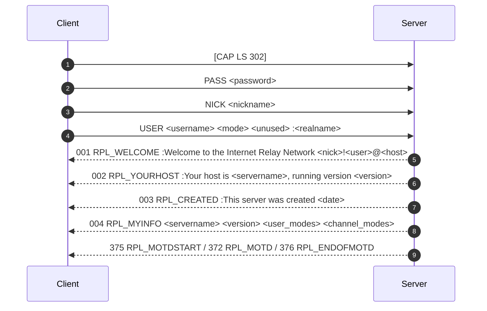

# IRC Protocol: Status Quo Specification

## 1. Executive Summary & Protocol Foundations

The Internet Relay Chat (IRC) protocol is a text-based, stateful, client-server/server-server protocol originally defined in **RFC 1459** (1993) and updated/clarified in **RFC 2810**, **RFC 2811**, **RFC 2812**, and **RFC 2813** (2000), along with modern **IRCv3** capability extensions.

In standard IRC architectures:
- Clients connect to servers over a reliable byte-stream transport (TCP).
- The protocol relies on asynchronous, bidirectional message exchanges.
- Servers maintain active connection states, channel graphs, membership lists, and routing tables.
- All communications are framed into line-oriented messages terminated by `\r\n` (CRLF).

---

## 2. Low-Level Message Framing & Wire Protocol

### 2.1 Message Syntax (RFC 2812 §2.3)
Each IRC message consists of up to three parts:
```
[:<prefix>] <command> [<params>] [:<trailing>] \r\n
```

1. **Prefix (Optional)**:
   - Starts with a colon `:`.
   - Used by servers to indicate message origin:
     - Server origin: `:irc.example.net`
     - Client origin: `:nickname!username@hostname`
   - Clients MUST NOT send arbitrary prefixes for themselves unless spoofing is permitted by server configuration.
2. **Command**:
   - Either a case-insensitive ASCII string (e.g., `NICK`, `JOIN`, `PRIVMSG`, `PING`) or a 3-digit numeric string (e.g., `001`, `353`, `461`, `482`).
3. **Parameters**:
   - Space-delimited parameters (`0x20`).
   - Up to 15 parameters total.
   - The final parameter may be a **trailing parameter**, introduced by a leading colon `:` (or being the 15th parameter), which allows space characters inside the string.
4. **Length Limit**:
   - The maximum total length of a single IRC message on the wire is **512 octets / bytes**, strictly including the trailing `\r\n`.
   - The effective payload length is therefore 510 bytes + `\r\n`.

### 2.2 Transport & Stream Handling
- **Stream-oriented transport**: TCP provides a stream of bytes without guaranteed packet boundaries. A single command may be split across multiple `recv()` calls (fragmentation), or multiple commands may arrive in a single `recv()` call (concatenation).
- **Line Buffering**: Servers must maintain a per-client receive buffer, accumulating chunks until `\r\n` (or robustly `\n`) is encountered.
- **Empty Lines / Whitespace**: Empty lines (`\r\n\r\n`) or extra spaces between arguments must be ignored silently.

---

## 3. Client Connection & Registration Lifecycle

### 3.1 Registration Sequence
A connecting client must register its connection before executing channel or messaging commands.



1. **`PASS <password>`**:
   - Required if the server enforces a server password.
   - Must be sent before `NICK` / `USER`.
   - If missing or incorrect: `464 ERR_PASSWDMISMATCH`.
   - If sent after registration is complete: `462 ERR_ALREADYREGISTRED`.
2. **`NICK <nickname>`**:
   - Identifies the user uniquely across the server.
   - Valid characters: Letters `[a-zA-Z]`, digits `[0-9]`, special characters `[][\\`_^{|}-]`, cannot start with a digit or hyphen.
   - Errors:
     - `431 ERR_NONICKNAMEGIVEN` (parameter missing)
     - `432 ERR_ERRONEUSNICKNAME` (invalid characters / length)
     - `433 ERR_NICKNAMEINUSE` (nickname already taken by another registered client)
   - Nickname collision / change: A registered user may change their nick dynamically. The server broadcasts `:oldnick!user@host NICK :newnick` to the client and all shared channel members.
3. **`USER <username> <mode> <unused> :<realname>`**:
   - Provides user credentials and real name.
   - Errors:
     - `461 ERR_NEEDMOREPARAMS`
     - `462 ERR_ALREADYREGISTRED`
4. **Capability Negotiation (`CAP`)**:
   - Modern clients (IRCv3) send `CAP LS` / `CAP END`.
   - Servers not supporting IRCv3 extensions reply with `CAP * LS :` or ignore/reject gracefully without failing connection registration.

---

## 4. Connection Keepalive, Ping/Pong & Termination

### 4.1 `PING` / `PONG` Protocol (RFC 2812 §3.7.2, §3.7.3)
- **Client to Server Keepalive**:
  - `PING <token>` or `PING :<token>`
  - Server MUST reply with: `:<servername> PONG <servername> :<token>`
  - Used by clients to measure latency and verify connection liveness.
- **Server to Client Ping**:
  - Server periodically sends `PING :<servername>` to idle clients.
  - Client must respond with `PONG :<token>`.
  - If client fails to respond within `PINGTIMEOUT`, server terminates connection with `Quit: Ping timeout`.

### 4.2 Connection Termination (`QUIT`)
- Command: `QUIT [:<quit_message>]`
- Behavior:
  - Server closes client socket.
  - Server broadcasts `:nick!user@host QUIT :<quit_message>` to all users sharing at least one channel with the quitting client.
  - Server removes client from all channel memberships and internal lookup tables.
  - Server frees all allocated memory and resources.

---

## 5. Channel Management & Membership Operations

Channels represent multicast groups whose names begin with `#` (standard public network channels) or `&` (local server channels).

### 5.1 Joining Channels (`JOIN`)
- Syntax: `JOIN <channel>{,<channel>} [<key>{,<key>}]` or `JOIN 0` (part all channels).
- Valid Channel Names: Length up to 50 chars, starts with `#` or `&`, no spaces, commas, or control characters.
- Behavior upon successful join:
  1. If channel does not exist, server creates it and assigns the joining user **Channel Operator (+o)** status.
  2. If channel exists, adds user as a regular member (unless invited/operator).
  3. Broadcasts `:nick!user@host JOIN :<channel>` to all members of the channel (including the joiner).
  4. Sends channel topic: `332 RPL_TOPIC` (or `331 RPL_NOTOPIC`).
  5. Sends user list: `353 RPL_NAMREPLY` (listing members prefixed with `@` for operators, `+` for voice, etc.) followed by `366 RPL_ENDOFNAMES`.
- Join Errors:
  - `461 ERR_NEEDMOREPARAMS`
  - `475 ERR_BADCHANNELKEY` (mode `+k` mismatch)
  - `471 ERR_CHANNELISFULL` (mode `+l` limit reached)
  - `473 ERR_INVITEONLYCHAN` (mode `+i` without active invitation)
  - `476 ERR_BADCHANMASK` / `403 ERR_NOSUCHCHANNEL`

### 5.2 Leaving Channels (`PART`)
- Syntax: `PART <channel>{,<channel>} [:<part_message>]`
- Behavior:
  - Broadcasts `:nick!user@host PART <channel> [:<part_message>]` to all channel members.
  - Removes client from channel.
  - If channel becomes empty, channel is destroyed.
- Errors:
  - `461 ERR_NEEDMOREPARAMS`
  - `403 ERR_NOSUCHCHANNEL`
  - `442 ERR_NOTONCHANNEL`

### 5.3 Topic Management (`TOPIC`)
- Syntax:
  - Query: `TOPIC <channel>`
  - Change: `TOPIC <channel> :<new_topic>`
  - Clear: `TOPIC <channel> :`
- Behavior:
  - Query returns `332 RPL_TOPIC <nick> <channel> :<topic>` (and `333 RPL_TOPICWHOTIME`) or `331 RPL_NOTOPIC`.
  - Change: If mode `+t` is set, only Channel Operators (`+o`) may change the topic. If `-t`, any member can change it.
  - On change: Broadcasts `:nick!user@host TOPIC <channel> :<new_topic>` to all channel members.
- Errors:
  - `461 ERR_NEEDMOREPARAMS`
  - `442 ERR_NOTONCHANNEL`
  - `482 ERR_CHANOPRIVSNEEDED` (when `+t` is active and user is not op)

### 5.4 Channel Operator Commands: `KICK` & `INVITE`
- **`KICK <channel> <user> [:<reason>]`**:
  - Ejects target client from `<channel>`.
  - Requires sender to be Channel Operator (`+o`).
  - Broadcasts `:nick!user@host KICK <channel> <target> :<reason>` to all channel members.
  - Target user is removed from channel membership.
  - Errors:
    - `461 ERR_NEEDMOREPARAMS`
    - `403 ERR_NOSUCHCHANNEL`
    - `442 ERR_NOTONCHANNEL` (sender not on channel)
    - `441 ERR_USERNOTINCHANNEL` (target not on channel)
    - `482 ERR_CHANOPRIVSNEEDED` (sender lacks `+o`)
- **`INVITE <user> <channel>`**:
  - Invites `<user>` to `<channel>`.
  - If `<channel>` is `+i` (invite-only), sender MUST be Channel Operator (`+o`).
  - If `<channel>` is not `+i`, standard members may invite (in RFC 2812).
  - Sends confirmation to sender: `341 RPL_INVITING <nick> <user> <channel>`.
  - Sends invite notice to target: `:sender!user@host INVITE <user> :<channel>`.
  - Adds target user to channel's internal invite list.
  - Errors:
    - `461 ERR_NEEDMOREPARAMS`
    - `401 ERR_NOSUCHSERVER` / `ERR_NOSUCHNICK`
    - `403 ERR_NOSUCHCHANNEL`
    - `442 ERR_NOTONCHANNEL`
    - `443 ERR_USERONCHANNEL`
    - `482 ERR_CHANOPRIVSNEEDED`

---

## 6. Channel Modes (RFC 2811 / RFC 2812 §3.2.3)

Modes modify channel behavior, access policies, and member privileges.

### 6.1 Mode Syntax
```
MODE <channel> {[+|-]|o|p|s|i|t|n|b|v|k|l} [<modeparams>...]
```

### 6.2 Standard Modes Catalog
| Mode | Name | Parameter on `+` | Parameter on `-` | Description |
| :--- | :--- | :--- | :--- | :--- |
| `i` | Invite-Only | None | None | Only invited users can join via `JOIN`. |
| `t` | Topic Protection | None | None | Only channel operators can change `TOPIC`. |
| `k` | Channel Key | `<key>` | `<key>` or None | Sets/removes password required to join channel. |
| `o` | Operator Privileges | `<target_nick>` | `<target_nick>` | Grants/revokes channel operator status (`@`). |
| `l` | User Limit | `<limit>` (integer) | None | Sets maximum concurrent members allowed in channel. |
| `m` | Moderated | None | None | Only ops and voiced users (`+v`) can send `PRIVMSG`. |
| `n` | No External Msgs | None | None | Disallows `PRIVMSG` from users outside channel. |
| `b` | Ban Mask | `<mask/nick>` | `<mask/nick>` | Bans matching hostmasks from joining channel. |

### 6.3 Mode Query & Broadcast
- Querying modes: `MODE <channel>` returns `324 RPL_CHANNELMODEIS <nick> <channel> <modes> [<modeparams>]` and `329 RPL_CREATIONTIME`.
- Changing modes:
  - Requires sender to be Channel Operator (`+o`).
  - Broadcasts `:nick!user@host MODE <channel> <applied_modes> [<params>]` to all channel members.
  - Multiple mode changes can be chained: `MODE #chan +itk-o secret alice`.

---

## 7. Messaging & Content Delivery

### 7.1 `PRIVMSG` & `NOTICE` (RFC 2812 §3.3.1, §3.3.2)
- Syntax: `PRIVMSG <target>{,<target>} :<text>` / `NOTICE <target> :<text>`
- **Direct Messaging (Nick target)**:
  - Formats message as `:sender!user@host PRIVMSG <target> :<text>` and sends exclusively to target client socket.
- **Channel Messaging (Channel target `#chan`)**:
  - Broadcasts `:sender!user@host PRIVMSG #chan :<text>` to all channel members **except the sender**.
- **Difference between `PRIVMSG` and `NOTICE`**:
  - `NOTICE` must NEVER trigger automatic replies (to prevent infinite reply loops between automated bots).
- Errors (for `PRIVMSG`):
  - `411 ERR_NORECIPIENT` (no target parameter)
  - `412 ERR_NOTEXTTOSEND` (empty trailing text)
  - `401 ERR_NOSUCHNICK` (target nickname does not exist)
  - `404 ERR_CANNOTSENDTOCHAN` (e.g. banned, not on channel with `+n`, or unvoiced on `+m`)

---

## 8. Server Information, Queries & Operator Administration

In full standard IRC networks:
- **`WHO <channel|mask>` / `WHOIS <nick>` / `WHOWAS <nick>`**: Query user identity, host, channels, operator status, idle time.
- **`LIST [<channels>]`**: Lists visible channels, topic, and member counts (`321 RPL_LISTSTART`, `322 RPL_LIST`, `323 RPL_LISTEND`).
- **`NAMES [<channels>]`**: Lists all nicknames in channels.
- **`MOTD` / `VERSION` / `TIME` / `ADMIN` / `INFO` / `LUSERS`**: Server metadata queries.
- **IRC Operator Admin Commands (Global)**:
  - `OPER <user> <password>`: Grants global server operator status.
  - `KILL <nick> <comment>`: Server operator forcibly drops a client connection.
  - `REHASH` / `RESTART` / `DIE`: Reloads configuration or stops the daemon.
  - `SQUIT <server> <comment>`: Drops server-to-server peering link.

---

## 9. Error Numerics & Reply Standards

Standard IRC reply format:
`:<servername> <3-digit-numeric> <recipient-nick> <arguments...> :<trailing-text>`

Standard RFC reply numerics:
- `001 RPL_WELCOME`, `002 RPL_YOURHOST`, `003 RPL_CREATED`, `004 RPL_MYINFO`
- `324 RPL_CHANNELMODEIS`, `331 RPL_NOTOPIC`, `332 RPL_TOPIC`, `341 RPL_INVITING`
- `353 RPL_NAMREPLY`, `366 RPL_ENDOFNAMES`
- `401 ERR_NOSUCHNICK`, `403 ERR_NOSUCHCHANNEL`, `404 ERR_CANNOTSENDTOCHAN`
- `411 ERR_NORECIPIENT`, `412 ERR_NOTEXTTOSEND`
- `431 ERR_NONICKNAMEGIVEN`, `432 ERR_ERRONEUSNICKNAME`, `433 ERR_NICKNAMEINUSE`
- `441 ERR_USERNOTINCHANNEL`, `442 ERR_NOTONCHANNEL`, `443 ERR_USERONCHANNEL`
- `451 ERR_NOTREGISTERED`
- `461 ERR_NEEDMOREPARAMS`, `462 ERR_ALREADYREGISTRED`, `464 ERR_PASSWDMISMATCH`
- `471 ERR_CHANNELISFULL`, `473 ERR_INVITEONLYCHAN`, `475 ERR_BADCHANNELKEY`
- `482 ERR_CHANOPRIVSNEEDED`
- `501 ERR_UMODEUNKNOWNFLAG`, `502 ERR_USERSDONTMATCH`

---

## 10. Robustness, Concurrency & Edge Case Requirements

Standard RFC-compliant IRC daemons must maintain stability under hostile network conditions:
1. **Partial Packet Aggregation**: `read()` / `recv()` stream buffering reconstructing split frames.
2. **Back-to-Back Frames**: Multiple complete commands in a single chunk (`JOIN #a\r\nPRIVMSG #a :hi\r\n`).
3. **Pipelining & Registration Race Conditions**: Handling `NICK` and `USER` in either order, handling rapid disconnects before registration completes.
4. **Abrupt Disconnects (TCP FIN/RST / `ECONNRESET`)**: Automatic state cleanup, channel membership pruning, avoiding stale socket descriptors or dangling pointers.
5. **Slow Clients & Bounded Buffers**: A slow or unresponsive client must not block the server event loop from servicing other active sockets.
6. **Case-Insensitivity**: Channel names (e.g., `#CHAN` vs `#chan`) and nicknames (`ALICE` vs `alice`) are treated case-insensitively using RFC 1459 mapping rules (`[` `]` `\` map to `{` `}` `|`).
